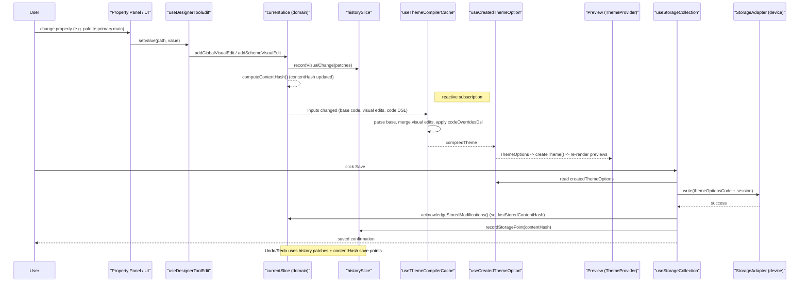

**Editor Architecture**

Purpose: A technical reference for the Theme Editor internals — how theme inputs (templates, visual edits, code overrides) flow through the compiler and storage into live MUI ThemeOptions used by previews. Useful for maintainers, contributors and performance work.

**Quick index**
- Pipeline overview
- Data shapes and contracts
- Core files & hooks (exact references)
- Storage flow & save points
- Compiler / AST transform details
- Performance / caching
- Pain points and concrete fixes
- Recommended next steps

**Pipeline (concise)**
- Inputs: Base Themes (`src/Templates/*`), Visual Edits (property panels), Code Overrides (JS/TS editor).
- Transform steps:
  1. Base theme string → parsed DSL via `parseThemeCode()` (`src/Editor/Design/compiler/parsing/codeStringParser.ts`).
  2. Visual edits: stored as flat path → value in `currentSlice` (`src/Editor/Design/Edit/useEdit/currentSlice.ts`).
  3. Code overrides: parsed AST → safe DSL via `transformCodeToDsl()` (`src/Editor/Design/compiler/transformation/codeStringToDsl.ts`).
  4. Merge order and result: `createThemeOptionsFromEdits()` + `transformDslToThemeOptions()` produce the final `ThemeOptions` used by previews (`src/Editor/Design/Edit/useThemeCompilerCache.ts`).
  5. `useCreatedThemeOption` resolves the final `ThemeOptions` per color scheme for `createTheme()` and preview components (`src/Editor/Design/Edit/useCreatedThemeOption.ts`).

**Data shapes**
- Base Theme: `baseThemeCode` (string; serialized ThemeOptions/DSL) stored in `currentSlice`.
- Visual Edits: `colorSchemeIndependentVisualToolEdits: Record<string, SerializableValue>` and `colorSchemes: Record<string, { visualToolEdits: Record<string, SerializableValue> }>` in `currentSlice`.
- Code Overrides: `codeOverridesSource` (string) + `codeOverridesDsl` (safe DSL object) + `codeOverridesFlattened` (dot-path map) stored in `currentSlice`.
- Content identity: `contentHash` produced by `computeContentHash()` (uses `baseThemeCode`, visual edits and `codeOverridesFlattened`) in `currentSlice`.

**Core files & hooks (precise locations)**
- Editor UI and orchestrator: `src/Editor/Editor.tsx`, `src/Editor/useEditor.ts` (UI state store).
- Domain model (current theme state): `src/Editor/Design/Edit/useEdit/currentSlice.ts`.
- Undo/Redo history: `src/Editor/Design/Edit/useEdit/historySlice.ts` (patch-based history entries + save-point support).
- Per-path editing helper: `src/Editor/Design/Edit/useDesignerToolEdit.ts` (reads `codeOverridesFlattened`, visual edits and uses compiler cache for base lookups).
- Theme compiler cache: `src/Editor/Design/Edit/useThemeCompilerCache.ts` (memoized merge: parse base → apply edits + code overrides DSL → create final theme options).
- Created theme hook (per-scheme ThemeOptions): `src/Editor/Design/Edit/useCreatedThemeOption.ts`.
- Code transform (AST → DSL): `src/Editor/Design/compiler/transformation/codeStringToDsl.ts` (Acorn-based transform; supports spacing, breakpoints, helpers and arrow functions into placeholders).
- Parsing & serializing helpers: `src/Editor/Design/compiler/parsing/codeStringParser.ts` and `src/Editor/Design/compiler/index.ts`.
- Flattening utilities: `src/Editor/Design/compiler/utilities/flatten.ts`.
- Storage / saved designs: `src/Editor/Design/Storage/useStorageCollection.ts`, `sessionBuilder.ts`, `sessionRestorer.ts`, `useEditorStoreSync.ts`.

**Storage flow & save points**
- `useStorageCollection.saveCurrent()` composes a `themeOptionsCode` (stringified `useCreatedThemeOption()`), optionally includes `buildSessionData()` snapshot, and writes via a `StorageAdapter` (defaults to `deviceStorageAdapter`).
- After successful write the code calls `acknowledgeStoredModifications()` on the `currentSlice` (sets `lastStoredContentHash` to `contentHash`) and `recordStoragePoint(contentHash)` on `historySlice` to mark a history save-point. This provides saved-state detection via `currentHash === lastStoredContentHash`.

**Compiler / AST transform details**
- `transformCodeToDsl()` (`codeStringToDsl.ts`) parses user-supplied ThemeOptions-like JS code with Acorn, walks AST, and emits a safe DSL: placeholders for `theme.spacing()`, `theme.breakpoints.*`, `theme.palette.*`, MUI helper calls (`alpha`, `lighten`, `darken`), arrow function style styleOverrides. All unrecognized or unsafe constructs are rejected or produce warnings.
- The DSL is then transformed to executable `ThemeOptions` via `transformDslToThemeOptions()` (`src/Editor/Design/compiler/transformation/dslToThemeOptions.ts`).
- `useDeveloperEditTools.applyModifications()` uses `transformCodeToDsl()` and then calls `setCodeOverrides(source, result.dsl, {}, error)`; note the `flattened` parameter is currently `{}` in this call-site (see 'gap' below).

**Performance & caching**
- `useThemeCompilerCache` memoizes compiled theme by JSON.stringify of the inputs: `baseThemeCode`, `baseVisualToolEdits`, `colorSchemes`, `codeOverridesDsl`, `activeColorScheme`. The compiled theme is stored in a ref and returned from the hook to avoid repeated expensive transforms.
- `useDesignerToolEdit` uses the compiled theme for fast base lookups (avoids recomputing full theme for per-path reads).
- Suggestions to improve perf (if desired): compute hash-based keys (faster than JSON.stringify), workerize AST parsing/DSL transforms, debounce code editor transforms, and memoize placeholder resolution.

**Observed gaps & concrete fixes**
- Gap: `codeOverridesFlattened` is supported by the domain model and used by `useDesignerToolEdit` for direct path lookups, but `useDeveloperEditTools.applyModifications()` currently passes an empty `{}` as `flattened` into `setCodeOverrides()` (so it doesn't populate the flattened path map).
  - Why it matters: per-path code override checks (for property panels) rely on `codeOverridesFlattened[path]`; if empty, the UI falls back to visual edits or compiled theme, which can make inline code overrides harder to detect and to undo/redo at the path level.
  - Concrete fix: compute `flattened` via the compiler's flatten utility after transforming code→DSL→ThemeOptions and pass it into `setCodeOverrides`. Implementation steps:
    1. In `useDeveloperEditTools.applyModifications`, when `result.dsl` exists, call `transformDslToThemeOptions(result.dsl, context)` to get themeOptions (or reuse existing code path in compiler). Then call `flattenThemeObject(themeOptions)` (from `src/Editor/Design/compiler/utilities/flatten.ts`) to produce a dot-path map. Pass that as `flattened` to `setCodeOverrides(code, result.dsl, flattened, null)`.
    2. Ensure `historySlice.recordCodeChange()` is used consistently (current code records the previous source in `currentSlice.setCodeOverrides` which is fine).
    3. Add unit/logic tests for per-path lookup in `useDesignerToolEdit` covering code overrides detection.

**History vs Storage coordination (clarified)**
- The repo's approach separates history from storage: `historySlice` stores patches and supports save-point marking (`recordStoragePoint`). `currentSlice` stores `lastStoredContentHash`. `useStorageCollection.saveCurrent()` writes, then calls `acknowledgeStoredModifications()` and `recordStoragePoint(contentHash)`.
- If there's any race or inconsistency, it's likely caused by callers not invoking `recordStoragePoint` or `acknowledgeStoredModifications` consistently — adding a single function that wraps both (e.g., `markSaved(snapshotId?)`) in `useStorageCollection` could centralize the protocol and reduce bugs.

**Recommendations (prioritized)**
1. Populate `codeOverridesFlattened` at the point of applying code overrides (see concrete fix above). This is a small, low-risk PR that improves per-path UX and makes history operations consistent.
2. Replace JSON.stringify keys in `useThemeCompilerCache` with a stable content hash (xxhash or murmurhash) to improve cache key computation performance.
3. Workerize parsing and DSL transformations (Acorn + AST walk) to avoid jank during heavy edits.
4. Add a `StorageService.markSaved()` helper that performs `acknowledgeStoredModifications()` + `recordStoragePoint()` atomically to eliminate ordering bugs.
5. Add tests for: per-path code override detection; history undo/redo around save points; storage conflict scenarios.

**Appendix: Quick references**
- `currentSlice` (domain state): `src/Editor/Design/Edit/useEdit/currentSlice.ts`
- `historySlice` (undo/redo): `src/Editor/Design/Edit/useEdit/historySlice.ts`
- `useDesignerToolEdit`: `src/Editor/Design/Edit/useDesignerToolEdit.ts`
- `useThemeCompilerCache`: `src/Editor/Design/Edit/useThemeCompilerCache.ts`
- Code transform: `src/Editor/Design/compiler/transformation/codeStringToDsl.ts`
- Parsing: `src/Editor/Design/compiler/parsing/codeStringParser.ts`
- Flatten util: `src/Editor/Design/compiler/utilities/flatten.ts`
- Storage collection: `src/Editor/Design/Storage/useStorageCollection.ts`

---

If you'd like, I can now either:
- (A) open a PR that implements the `codeOverridesFlattened` population (small change) and add a unit test, or
- (B) commit this doc into the repo (I already added it), or
- (C) expand the doc with a sequence diagram or step-by-step code walkthrough for `useThemeCompilerCache`.

Which would you like next?

**Sequence Diagram**

This diagram shows the normal happy-path: UI edits flow into the domain `currentSlice`, history receives patch entries, the compiler cache compiles a merged theme for previews, and storage persists a snapshot and marks a save point in history.

